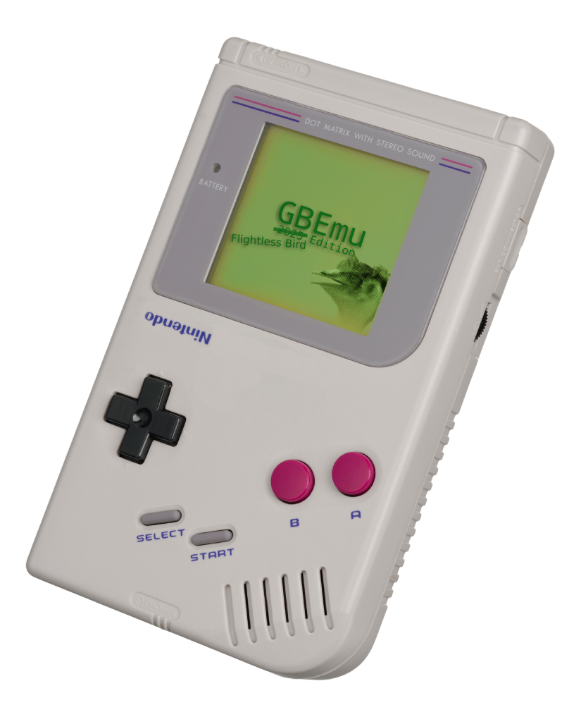

# GBEmu

<div align="center">
  
</div>

> This project was originally created on Windows 98 by Bandit. Yes, that is his real name. He's since upgraded to Windows Vista.

## Requirements

### Windows
- MinGW (Windows GNU)
- SDL2

### Linux
- GCC
- SDL2 (`libsdl2-dev` for Deb, `sdl2` for Arch <3)

### macOS
- GCC or Clang
- SDL2 (`brew install sdl2`)

## How to Build

Build the project:
   ```bash
   make all
   ```

Run the emulator:
   ```bash
   ./bin/gb-emu <legally acquired romfile.gb> # On Linux/macOS
   ./bin/gb-emu.exe <...> # On Windows... or use this as a chance to dual boot arch linux
   ```

## Clean Up

Rm build artifacts:
```bash
make clean
```